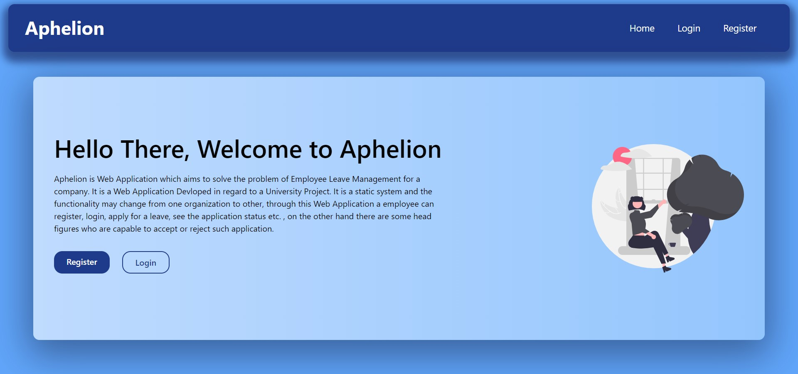
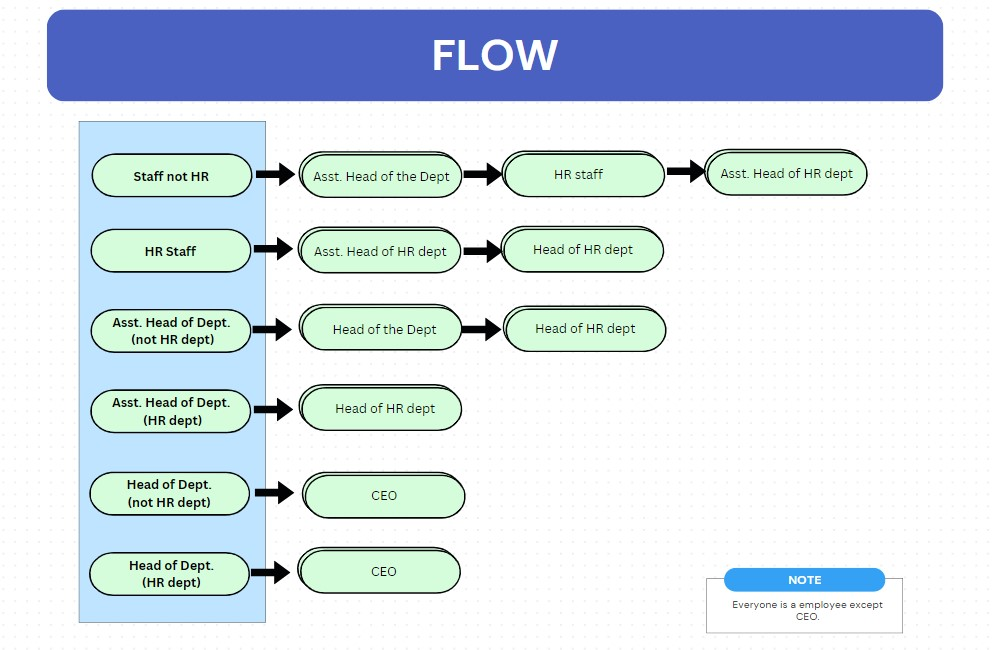
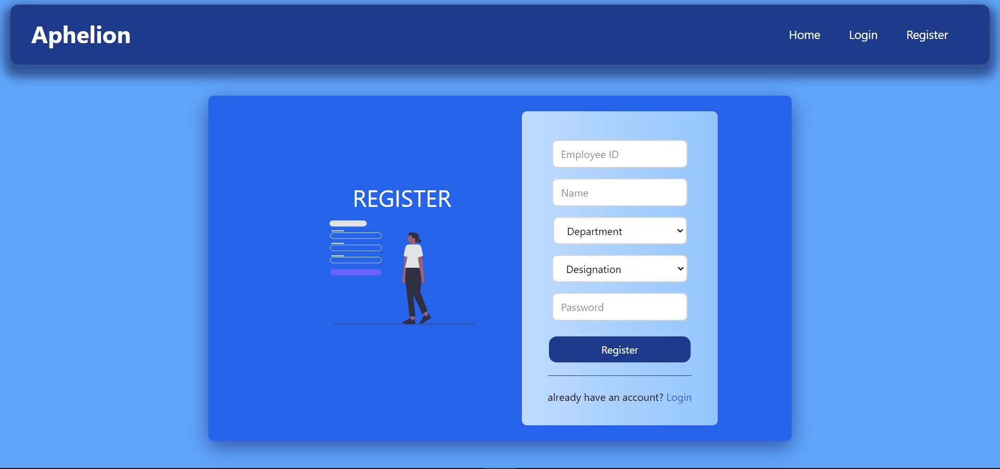
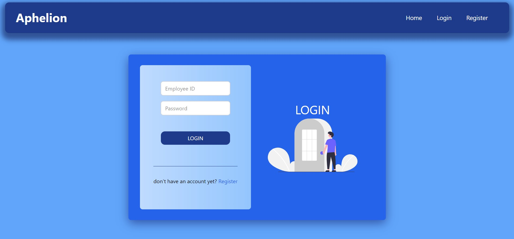

# Aphelion: Leave Management System for Employees

Aphelion is a modern, web-based Leave Management System designed to streamline and automate the leave application and approval process within organizations. Built using the MERN stack and enhanced with Tailwind CSS, it offers a secure, efficient, and user-friendly experience for both employees and administrators.



## 🚀 Features

- 🔐 Secure authentication using JWT and password hashing with bcrypt
- 📋 Role-based access control for employees, managers, HR, and CEO
- 📈 Real-time leave status tracking and notifications
- 📊 Comprehensive reporting and analytics
- 🌐 Fully web-based and mobile-compatible interface
- 📁 Comment threads on leave applications
- 🧾 Accurate leave balance and payroll integration
- 🧠 Intelligent leave flow routing and timestamp logging

## 🧱 Tech Stack

**Frontend**:
- React.js
- Tailwind CSS
- HTML5, CSS3

**Backend**:
- Node.js
- Express.js

**Database**:
- MongoDB
- Mongoose ODM

**Authentication & Security**:
- JWT (JSON Web Tokens)
- bcrypt
- HTTPS

---

## 🏗️ Architecture Overview

### 🧠 Context Diagram
This shows the interactions between the Leave Management System and different user roles:


### 🔄 Leave Approval Flow
The leave approval path varies based on the user's role and department:



### 🏢 Organizational Hierarchy
Visual breakdown of role distribution:


---

## 💻 UI Previews

### Register and Login Interface
User Friendly Login and Register Page





### 🌟 Dashboard
View a summary of leaves taken, pending applications, and user profile:


### 📝 Apply for Leave
Simple, clean form to request a leave:


### 📄 View Application Status
Track leave status with timestamps and progress:


### 👥 Manage Department Employees
Admins can monitor and manage staff records:


---

## 📚 Modules & Roles

Each user role has custom access and features:

| Role | Features |
|------|----------|
| **Technical Staff** | Apply for leave, view history/status |
| **Assistant Head (Tech/HR)** | Approve/reject leaves within department |
| **Head (Tech/HR)** | Department-wide leave management |
| **HR Staff** | Apply & manage HR department leaves |
| **CEO** | Org-wide access and final-level approvals |

---

## 📦 System Requirements

- Compatible with Chrome, Firefox, Edge, Safari
- Runs on Windows, macOS, Linux
- No Requirement of internet connection, runs locally

---

## 📂 Setup Instructions

```bash
# Clone the repository
git clone https://github.com/yourusername/aphelion-leave-management.git
cd aphelion-leave-management

# Install backend dependencies
cd backend
npm install

# Setup environment variables
cp .env.example .env
# Edit the .env with your MongoDB URI and JWT secret

# Start backend
npm start

# Install frontend dependencies
cd ../frontend
npm install

# Start frontend
npm run dev
